# TCFL

train:

```shell
# PKU37 --> ./data/
python train.py --batch_size 2
```

eval:

```shell
# DUKE17 --> ./data/
python evaluate.py --epoch 600
```

> EPI, GCMSE, PSNR, SSIM 等指标的计算均在 utils.py 中

传统方法:

```shell
python BM3D.py
python NLM.py
```

> 传统方法结果均在./img/下

## 问题与一些结论（ Version 2: 7.10）

### 上一次的遗留问题

#### 判别器结构

```shell
----------------------------------------------------------------
        Layer (type)               Output Shape         Param #
================================================================
            Conv2d-1         [-1, 64, 320, 320]           1,088
         LeakyReLU-2         [-1, 64, 320, 320]               0
            Conv2d-3        [-1, 128, 160, 160]         131,200
    InstanceNorm2d-4        [-1, 128, 160, 160]               0
         LeakyReLU-5        [-1, 128, 160, 160]               0
            Conv2d-6          [-1, 256, 80, 80]         524,544
    InstanceNorm2d-7          [-1, 256, 80, 80]               0
         LeakyReLU-8          [-1, 256, 80, 80]               0
            Conv2d-9          [-1, 512, 40, 40]       2,097,664
   InstanceNorm2d-10          [-1, 512, 40, 40]               0
        LeakyReLU-11          [-1, 512, 40, 40]               0
        ZeroPad2d-12          [-1, 512, 41, 41]               0
           Conv2d-13          [-1, 512, 40, 40]       4,194,816
   InstanceNorm2d-14          [-1, 512, 40, 40]               0
        LeakyReLU-15          [-1, 512, 40, 40]               0
        ZeroPad2d-16          [-1, 512, 41, 41]               0
           Conv2d-17            [-1, 1, 40, 40]           8,193
================================================================
Total params: 6,957,505
Trainable params: 6,957,505
Non-trainable params: 0
----------------------------------------------------------------
Input size (MB): 1.56
Forward/backward pass size (MB): 263.15
Params size (MB): 26.54
Estimated Total Size (MB): 291.25
---------------------------------------------------------------
```

> 判别器结构只要是像 PatchGAN 那种全卷积就行，损失就照着 lsgan / vanilla 的模式应该就可以

#### 生成固定矩阵

**在计算需要反传到生成器的 loss 时，需要避免加上 C_C 的 GAN 损失。**

#### 能不能只有一个生成器

不太行，拉开 N_A 与 N_B 会导致网络收敛问题（下文有）

### 当前结果

与原文不一样的地方：

1. **Frozen BN**
2. **WGAN**
3. 在 **128 \* 128 分辨率**下训练，batch-size取24，跑600个epoch，耗时大约12h（应该没有完全收敛）
4. loss_total = loss_identity \* **25** + loss_gan
5. 判别器的学习率调为 2e-5，且进行 1e-3 的参数截断（为了配合 WGAN ）

效果图：

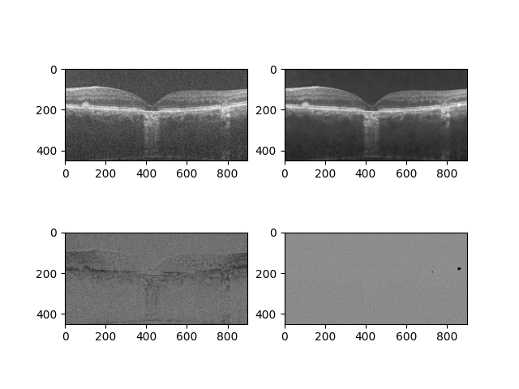

第一行左边为噪声图，右侧为模型处理后去噪的图

第二行左侧为噪声本身，右侧为拟合出来的噪声

> 第二行右侧图黑色一块是我生成噪声时进行了 clip(-1, 1)，也可以说明应该还没有收敛完全

一些数值结果(DUKE17)：

| metrics | psnr | ssim | gcmse |
| -- | -- | -- | -- |
| noise | 17.74366911719827 | 0.2124516611408509 | 100.1678589541245 |
| mine | 25.663886070251465 | 0.7351392679465174 | 34.32644832993514 |
| article | 26.304±1.429 | 0.682±0.038 | 30.407±20.114 |

> ssim 高了挺多，可能是计算方式不同导致的，我直接拿 skimage 算的

模型参数在 `./ckpt/epoch_600.pth`

运行：

```shell
python evaluate.py --epoch 600
```

### 关于 loss_identity 组成的一点思考

由于之前跑出来结果没有达到去噪效果，我在 loss_identity 中加入了 TVLoss 来辅助。

此时，

$ loss_{identity} = l_1(A_1, A_2) + l_1(B_1, B_2) + l_1(C_C, C_{C1} + l_1(C_C, C_{C2}) + \sigma * TVLoss({A_1, A_2, B_1, B_2, C_{C1}, C_{C2}}) $

$\sigma$ 人为调整

#### 果然也有 Deep Image Prior

在使用 lsgan 的 GAN 损失值计算的情况下， $\sigma$ ＞ 1 的时候，网络会先拟合一个比较干净的图像出来，再去学习噪声的生成。

| epoch | 1 | 2 | 3 | 4 |
| -- | -- | -- | -- | -- |
| img | 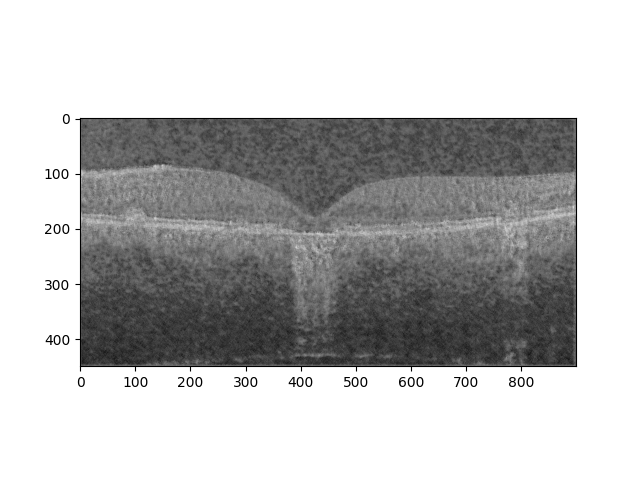 | 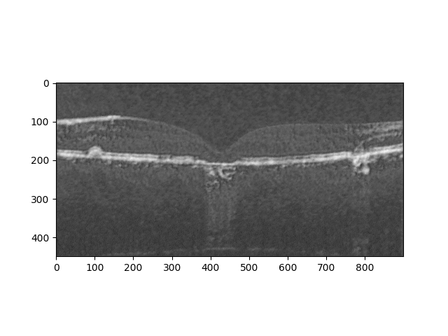 | 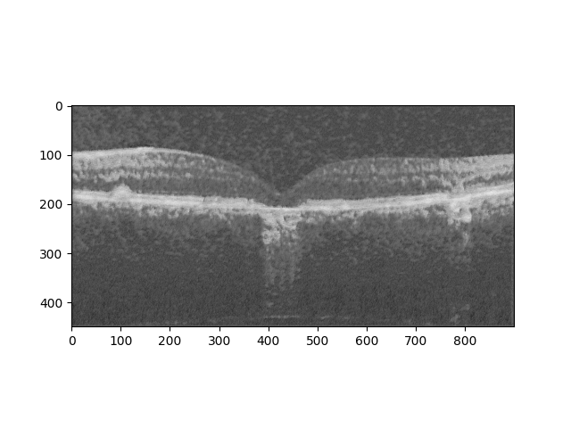 | 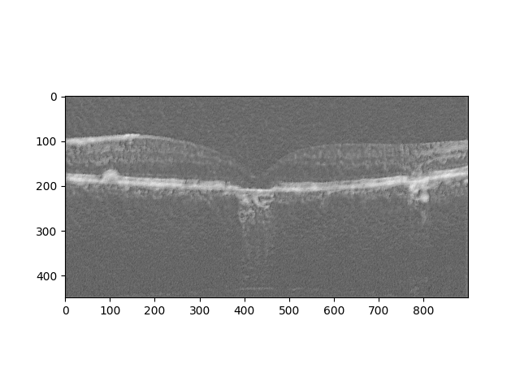 |

可以看到第三个 epoch 的时候是一个比较干净的图像，但是到了第四个 epoch 时斑点噪声就比较多了

模型参数均在 `./ckpt` 中

> 可能是因为图像的噪声中有很丰富的结构信息，是不是可以认为该类图像的噪声本身也是带噪声的图像...

#### 直接拉开 N_A 和 N_B ？

我们观察上一个出现 Deep Image Prior 现象时 loss_identity 中组件的表现。

```shell
0.05340547114610672 0.05819351226091385 0.7013545036315918 0.7034275531768799 0.13880518078804016
epoch: 3/50:  94%|████████████████████████████████████████████████████████████████▌    | 1616/1728 [00:52<00:03, 31.69it/s, loss_GAN=0.050804, loss_identity=11.432302, loss_total=68.789271]
0.05476909130811691 0.056480035185813904 0.08251243084669113 0.09584532678127289 0.12837976217269897
epoch: 3/50:  94%|█████████████████████████████████████████████████████████████████▏   | 1632/1728 [00:52<00:03, 31.58it/s, loss_GAN=0.050494, loss_identity=11.324092, loss_total=68.139321]
0.052482329308986664 0.0550091490149498 1.014410138130188 1.0172127485275269 0.11858255416154861
epoch: 3/50:  95%|█████████████████████████████████████████████████████████████████▊   | 1648/1728 [00:53<00:02, 31.25it/s, loss_GAN=0.050204, loss_identity=11.348157, loss_total=68.282397]
0.055511474609375 0.05498819798231125 1.3794198036193848 1.375799298286438 0.12348871678113937
epoch: 3/50:  96%|██████████████████████████████████████████████████████████████████▍  | 1664/1728 [00:53<00:02, 30.85it/s, loss_GAN=0.049930, loss_identity=11.648758, loss_total=70.085383]
0.04808571934700012 0.056116536259651184 0.7461830377578735 0.7440229058265686 0.11437128484249115
epoch: 3/50:  97%|███████████████████████████████████████████████████████████████████  | 1680/1728 [00:54<00:01, 31.06it/s, loss_GAN=0.049764, loss_identity=11.706327, loss_total=70.430015]
0.05001030117273331 0.05409717559814453 0.6197338700294495 0.6147241592407227 0.12020451575517654
epoch: 3/50:  98%|███████████████████████████████████████████████████████████████████▋ | 1696/1728 [00:54<00:01, 31.67it/s, loss_GAN=0.049620, loss_identity=11.756430, loss_total=70.730188]
0.052191853523254395 0.05453606694936752 1.0703130960464478 1.0641224384307861 0.1299651563167572
epoch: 3/50:  99%|████████████████████████████████████████████████████████████████████▎| 1712/1728 [00:55<00:00, 30.72it/s, loss_GAN=0.049450, loss_identity=11.734036, loss_total=70.594422]
0.04869448393583298 0.050357967615127563 0.6040277481079102 0.6046388745307922 0.12116462737321854
epoch: 3/50: 100%|█████████████████████████████████████████████████████████████████████| 1728/1728 [00:56<00:00, 30.85it/s, loss_GAN=0.049246, loss_identity=11.675805, loss_total=70.244293]
epoch: 4/50:   0%|                                                                                                                                                  | 0/1728 [00:00<?, ?it/s]
0.045300837606191635 0.0450688861310482 0.7856287956237793 0.7813639640808105 0.09725571423768997
epoch: 4/50:   1%|▋                                                                       | 16/1728 [00:00<00:57, 29.91it/s, loss_GAN=0.019612, loss_identity=3.964928, loss_total=23.849548]
0.05933791771531105 0.06178610026836395 0.4389132559299469 0.43935441970825195 0.1112072691321373
epoch: 4/50:   2%|█▎                                                                      | 32/1728 [00:01<00:53, 31.84it/s, loss_GAN=0.022671, loss_identity=4.955173, loss_total=29.841259]
0.06323587894439697 0.058453112840652466 0.823889434337616 0.8037009239196777 0.12047340720891953
epoch: 4/50:   3%|██                                                                      | 48/1728 [00:01<00:55, 30.50it/s, loss_GAN=0.021614, loss_identity=5.170075, loss_total=31.110113]
0.06575097143650055 0.056037865579128265 0.8935481309890747 0.8913643956184387 0.12881208956241608
epoch: 4/50:   4%|██▋                                                                     | 64/1728 [00:02<00:55, 30.21it/s, loss_GAN=0.020333, loss_identity=8.387200, loss_total=50.416378]
0.052759621292352676 0.05633168667554855 0.9065536856651306 0.9100802540779114 0.08993728458881378
epoch: 4/50:   5%|███▎                                                                   | 80/1728 [00:02<00:52, 31.37it/s, loss_GAN=0.020138, loss_identity=10.236945, loss_total=61.513567]
```

上面数据中，两个 iter 之间的五个数分别是

$l_1(A_1, A_2) $

$ l_1(B_1, B_2) $

$ l_1(C_C, C_{C1} $

$ l_1(C_C, C_{C2}) $

$ l_1(N_A, N_B) $

可以看见一般 N_A 与 N_B 之间的差距还是比较大的，强行拉开可能会导致生成的噪声数值过大（比如，本来是0~1的张量，部分区域生成的像素是100或者200）

> 在一些实验中发现 loss(C_C, C_C1) + loss(C_C, C_C2) 与 loss(N_A, N_B) 在大部分样本下收敛速度成比例关系（要么一起变小要么一起变大）

### 下一步

1. 不同的训练方法: 目前已经跑通了 CNCL-denoising、DRGAN、R2R
2. 不同的网络：`models.py`中已经加入了UNet、SRDenseNet
3. 写一下 DDP 支持多卡 train

## 问题（ Version 1: 7.3.）

我觉得 TCFL 有一些问题

### 数据（已解决）

数据应该是只公开了一部分，论文里面是1850个噪声图像，实际是1732，应该是只有训练集

### 判别器模型结构（已解决）

在 Fig.4 中，判别器结构应当如下：

```shell
----------------------------------------------------------------
        Layer (type)               Output Shape         Param #
================================================================
            Conv2d-1         [-1, 64, 320, 320]           1,088
         LeakyReLU-2         [-1, 64, 320, 320]               0
            Conv2d-3        [-1, 128, 160, 160]         131,200
    InstanceNorm2d-4        [-1, 128, 160, 160]               0
         LeakyReLU-5        [-1, 128, 160, 160]               0
            Conv2d-6          [-1, 256, 80, 80]         524,544
    InstanceNorm2d-7          [-1, 256, 80, 80]               0
         LeakyReLU-8          [-1, 256, 80, 80]               0
            Conv2d-9          [-1, 512, 40, 40]       2,097,664
   InstanceNorm2d-10          [-1, 512, 40, 40]               0
        LeakyReLU-11          [-1, 512, 40, 40]               0
           Conv2d-12          [-1, 512, 39, 39]       4,194,816
  ReflectionPad2d-13          [-1, 512, 40, 40]               0
   InstanceNorm2d-14          [-1, 512, 40, 40]               0
        LeakyReLU-15          [-1, 512, 40, 40]               0
           Conv2d-16            [-1, 1, 39, 39]           8,193
  ReflectionPad2d-17            [-1, 1, 40, 40]               0
================================================================
Total params: 6,957,505
Trainable params: 6,957,505
Non-trainable params: 0
----------------------------------------------------------------
Input size (MB): 1.56
Forward/backward pass size (MB): 255.97
Params size (MB): 26.54
Estimated Total Size (MB): 284.07
----------------------------------------------------------------
```

也就是后面几层是 40 \* 40 的分辨率

但是原始的 PatchGAN 论文提供的[代码](https://github.com/junyanz/pytorch-CycleGAN-and-pix2pix/blob/003efc4c8819de47ff11b5a0af7ba09aee7f5fc1/models/networks.py#L538)中的网络结构是

```shell
----------------------------------------------------------------
        Layer (type)               Output Shape         Param #
================================================================
            Conv2d-1         [-1, 64, 320, 320]           1,088
         LeakyReLU-2         [-1, 64, 320, 320]               0
            Conv2d-3        [-1, 128, 160, 160]         131,200
    InstanceNorm2d-4        [-1, 128, 160, 160]               0
         LeakyReLU-5        [-1, 128, 160, 160]               0
            Conv2d-6          [-1, 256, 80, 80]         524,544
    InstanceNorm2d-7          [-1, 256, 80, 80]               0
         LeakyReLU-8          [-1, 256, 80, 80]               0
            Conv2d-9          [-1, 512, 79, 79]       2,097,664
   InstanceNorm2d-10          [-1, 512, 79, 79]               0
        LeakyReLU-11          [-1, 512, 79, 79]               0
           Conv2d-12            [-1, 1, 78, 78]           8,193
================================================================
Total params: 2,762,689
Trainable params: 2,762,689
Non-trainable params: 0
----------------------------------------------------------------
Input size (MB): 1.56
Forward/backward pass size (MB): 285.68
Params size (MB): 10.54
Estimated Total Size (MB): 297.78
----------------------------------------------------------------
```

后面几层是没有降分辨率的（由于 kernel 是4所以会分辨率会减1）

**判别器在这种训练方式中很重要，结构可能并不是这个样子，loss_GAN的计算可能也有些许问题**

### 训练方式

```python
# N2P Part
N_A = self.generator(Image_A)
N_B = self.generator(Image_B)
C_A1 = Image_A - N_A
C_B1 = Image_B - N_B

# P2P Part
I_A = C_A1 + N_B
I_B = C_B1 + N_A
C_A2 = I_A - self.generator(I_A)
C_B2 = I_B - self.generator(I_B)

# C2P Part
I_C1 = C_C + N_A
I_C2 = C_C + N_B
C_C1 = I_C1 - self.generator(I_C1)
C_C2 = I_C2 - self.generator(I_C2)
```

```self.generator(X) = Y``` 中 X 代表输入带噪声的图片， Y 代表输出的噪声。仅使用上述的训练方式会导致一个问题：在任意输入的时候 generator 输出一个固定的张量 A 即可。

我们假定 ```self.generator(x) = A```， 其中 x 可以是任一张量， A 是一个确定的张量。带入数据流：

```python
# N2P Part
N_A = A
N_B = A
C_A1 = Image_A - A
C_B1 = Image_B - A

# P2P Part
I_A = C_A1 + N_A = C_A1 + A = Image_A
I_B = C_B1 + N_A = C_B1 + A = Image_B
C_A2 = I_A - A = Image_A
C_B2 = I_B - A = Image_B

# C2P Part
I_C1 = C_C + N_A = C_C + A
I_C2 = C_C + N_B = C_C + A
C_C1 = I_C1 - self.generator(I_C1) = I_C1 - A = C_C
C_C2 = I_C2 - self.generator(I_C2) = I_C2 = A = C_C
```

我们的损失函数中有关图像质量的损失构成如下：

```shell
Loss_A = L1Loss()(C_A1, C_A2)
Loss_B = L1Loss()(C_B1, C_B2)
Loss_C1 = L1Loss()(C_C1, C_C)
Loss_C2 = L1Loss()(C_C2, C_C)
```

我们带入假定 ```self.generator(x) = A``` 的结果，可以发现

```shell
Loss_A = L1Loss()(Image_A - A, Image_A)
Loss_B = L1Loss()(Image_B - A, Image_B)
Loss_C1 = L1Loss()(C_C, C_C) = 0
Loss_C2 = L1Loss()(C_C, C_C) = 0
```

此时 A $\to$ 0 的时候，整个损失就为0

很显然这种训练方法（不加入判别器损失的时候）极容易陷入这种局部最优。

**由于算力不足，我测试了几次小分辨率下训练的情况，小分辨率下加入了判别器的损失也很容易直接生成器只会生成0。在只有少量数据的情况下也会有类似问题。在一般的情况（加入了判别器损失）下，会生成一个a * E(单位矩阵)， a是一个小于1的数，为什么会发生这种情况我也没有很理解（感觉也可能因为显存不够我设置的batch_size是1）。**

#### 关于生成器只能生成固定矩阵的举例

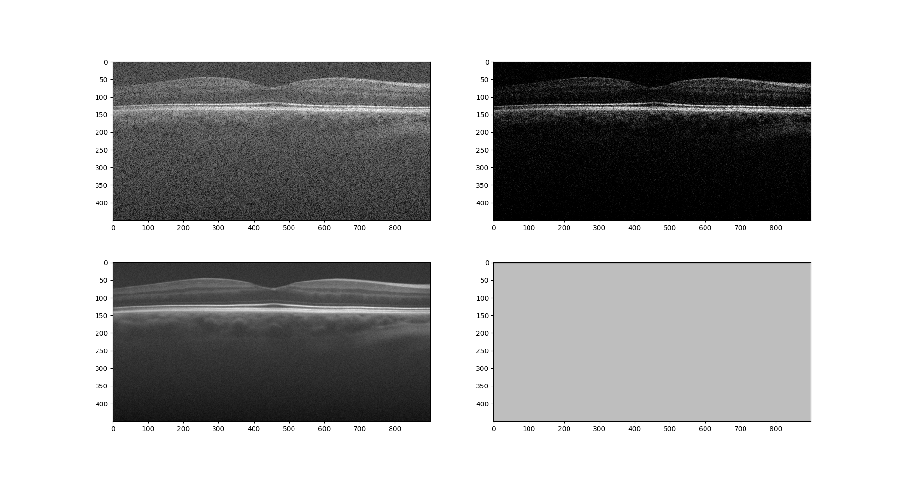

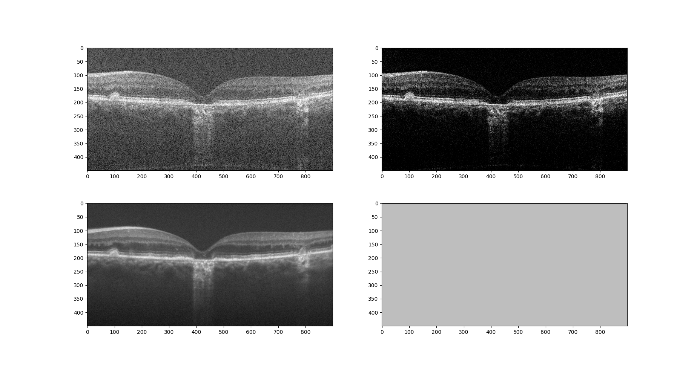

上述两者生成的 noise 张量的差距为

| MSE | MAE |
| -- | -- |
| 5.1258e-17 | 9.1298e-10 |

```noise1.pkl``` 与 ```noise2.pkl``` 均是由 ```./ckpt/generator/epoch_100.pth``` 生成的结果

```shell
python compare.py
```

## 可以只用一个生成器嘛

判别器是用来判断 Clean 的图像是人为创造的还是原始的，个人认为它还可以避免陷入上述说的局部最优问题。但是拉开 N_A 与 N_B 的距离理论上也能防止生成器只能生成固定矩阵的结果。这也意味着或许可能只用一个生成器就能训练。

见 ```./trainers.py#L56``` 引入 ```sigma * (exp(-Loss(N_A, N_B)) - 1)``` 后，训练结果如下：

| 0.1 | 0.5 | 1 |
| -- | -- | -- |
| 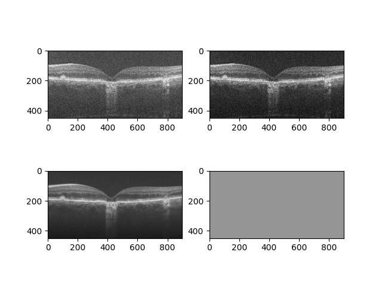 | 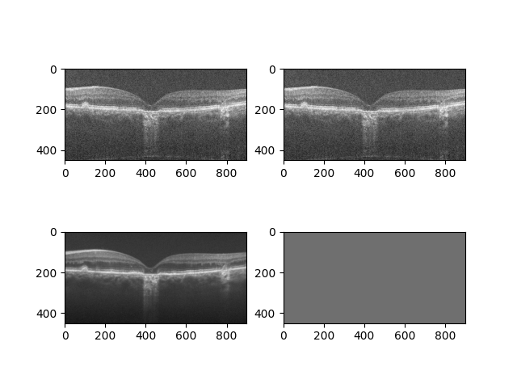 | 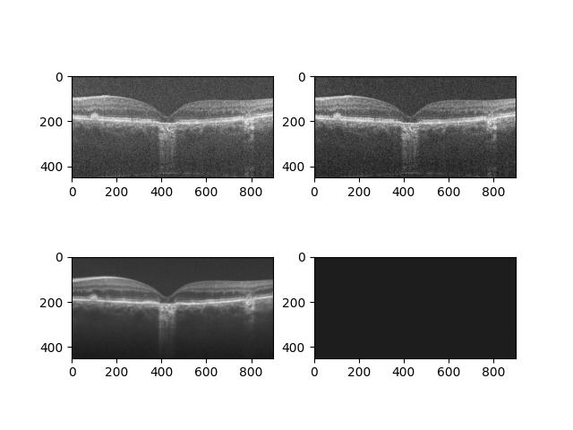 |
| 2.5 | 5 | 10 |
| 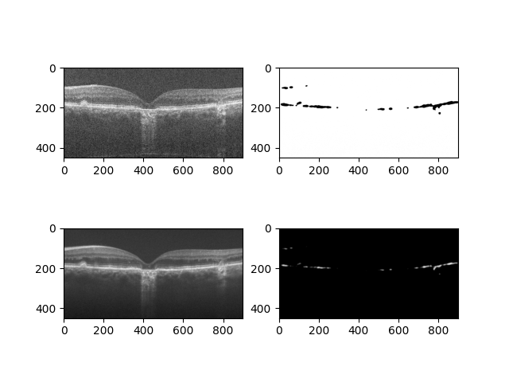 |  | 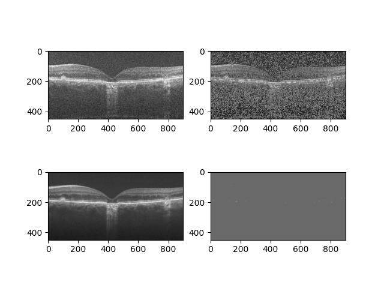 |

sigma 大于1的时候确实拉开了 N_A 与 N_B，但是拉的太开了...

而在 sigma 小于1的时候跟上面包含判别器的效果比较一致

> 直接在原质量损失上减去 Loss(N_A, N_B) 也有用

**可能可以通过调参找到一个参数能够做到单一生成器训练，但是极不稳定。个人感觉我的复现在判别器及其损失的实现上应该有比较大的问题**
